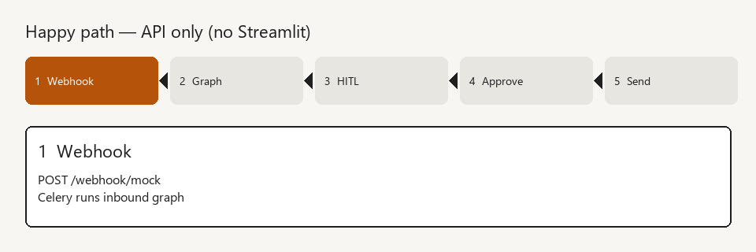
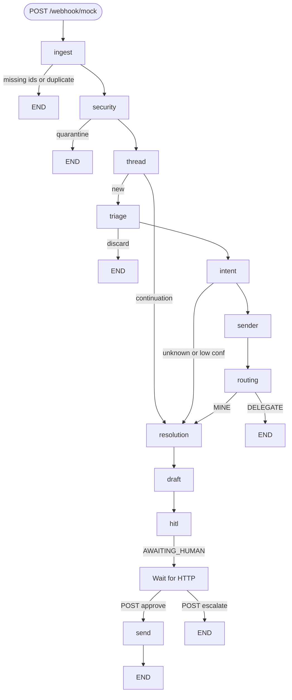

# p2p-ai-langraph

**LangGraph AP email assistant — HTTP operators, no Streamlit.**

Inbound supplier mail is classified, matched against mock SAP, drafted, and parked for a human. Send runs only after `POST /tickets/{id}/approve`.

> Park at HITL. Never auto-send.

<div align="center">


</div>

---

## What it is

This repo rebuilds a procure-to-pay AP assistant with **native LangGraph** instead of Launchpad `TicketWorkflow`. The graph, domain, and ports do not import Postgres, Redis, or an LLM vendor — adapters swap (memory in tests, Postgres in the worker).

Operators use **curl** or the React operator console in `frontend/`. There is no Streamlit UI.

Day plans: [docs/README.md](docs/README.md). Call diagrams: [docs/diagrams/LAB_CALL_DIAGRAMS.md](docs/diagrams/LAB_CALL_DIAGRAMS.md).

---

## Happy path

Webhook → inbound graph → `AWAITING_HUMAN` → approve → mock send.

<div align="center">



</div>

| Step | What happens |
|---|---|
| `POST /webhook/mock` | Celery runs the **inbound** graph only |
| HITL | Ticket status `awaiting_human`; draft stored if the decision table allows |
| `POST /tickets/{id}/approve` | `HitlService` runs the send node (not on the inbound spine) |
| Escalate | `escalated`, no send |

Resolution can retry **once** with wider match tolerances when `RESOLUTION_RETRY_ENABLED=true`. Default is **off** so golden eval stays comparable to the original assistant.

---

## Core behaviour

- **Security** — sender-domain whitelist; optional SPF/DKIM
- **Triage / intent** — AP vs discard; payment status, delay reason, future timing (LLM behind `LLMPort`)
- **Routing** — MINE vs DELEGATE from sender directory rules
- **Resolution** — exact ref → fuzzy ≥ 0.85 → amount ± tolerance + supplier; VAT notes; PAID without clearing → HITL
- **Draft** — deterministic target (sender / invoicing / payments / approval owners); LLM writes `generated_text` only
- **HITL API** — list/get tickets, draft, approve, escalate, stats; 409 if not awaiting human

Early exits: missing ids, duplicate, quarantine, discard, delegate.

---

## Technical highlights

- **Hexagon** — 7 ports: Email, Tickets, LLM, SAP, Audit, Senders, Drafts. `WorkflowDeps` is closed in node factories, **never** in graph state.
- **LangGraph** — `StateGraph` + conditional edges; inbound ends at HITL (assistant option 2: approve calls `make_send_node`).
- **Deterministic + LLM** — match and draft target are rules; triage, intent, VAT notes, and draft text are structured LLM calls.
- **Eval** — 20 golden emails, `FixtureGuidedLLM`, `ainvoke`; exit 1 if success &lt; 0.80.

### Stack

| Layer | Tech |
|---|---|
| Graph | LangGraph |
| API | FastAPI (`/webhook/mock`, `/tickets`, approve/escalate) |
| Queue | Celery + Redis (Windows worker: `--pool=solo`) |
| Store | Postgres (Alembic); in-memory stores in tests and eval |
| SAP / senders | JSON fixtures + mock adapters |
| LLM | `MockLLMAdapter` / fixture-guided eval (optional live key later) |

**Out of scope:** Streamlit, OCR, live Nylas, live SAP, auto-send.

---

## Workflow



Day 7 retry stays **inside** `resolution` (not extra graph nodes).

---

## Run

Postgres **5434**, Redis **6380**. From this directory:

```powershell
docker compose up -d
copy .env.dev .env
alembic upgrade head
```

Fix `DATABASE_URL` in `.env` to `lab:lab_dev` if compose uses those credentials.

**1 — API**

```powershell
uvicorn app.api.main:app --reload --port 8000
```

**2 — Worker (Windows)**

```powershell
celery -A app.worker.tasks:celery_app worker --pool=solo --loglevel=info
```

**3 — Ingest** (whitelisted `acme-supplies.com`; mock LLM defaults to AP + `INV-2026-0001`):

```powershell
curl -s -X POST http://127.0.0.1:8000/webhook/mock -H "Content-Type: application/json" -d "{\"thread_id\":\"t1\",\"message_id\":\"msg-demo-1\",\"from\":\"billing@acme-supplies.com\",\"subject\":\"Invoice INV-2026-0001\",\"body\":\"Please confirm payment status\"}"
```

If Redis is down, the same POST runs the graph in-process and returns `{ "ticket_id", "status" }`.

```powershell
curl -s http://127.0.0.1:8000/health
curl -s http://127.0.0.1:8000/tickets/<ticket-uuid>
curl -s -X POST http://127.0.0.1:8000/tickets/<ticket-uuid>/approve -H "Content-Type: application/json" -d "{\"operator_id\":\"op_joao\"}"
```

Unknown domain (`evil.example`) → `quarantined`. High-confidence non-AP → `discarded`. Other operator → `delegated`.

**4 — Operator UI** (API on port 8000)

```powershell
cd frontend
npm install
npm run dev
```

Open the Vite URL (usually `http://localhost:5173`). Copy `frontend/.env.example` to `frontend/.env` if `VITE_API_URL` is not already `http://localhost:8000`. This app is pinned to Vite 6 so it runs on Node 20.18.

**Eval** (in-memory, fixture-guided LLM, retry off):

```powershell
python scripts/run_eval.py
```

Writes `golden_dataset/baselines/v1.json`.
