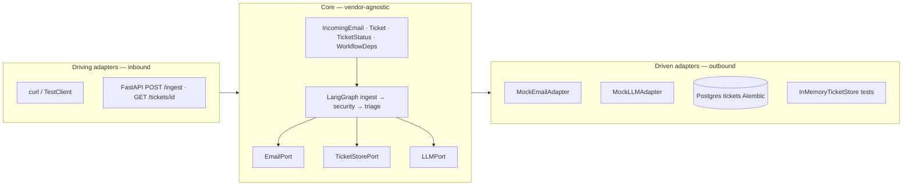
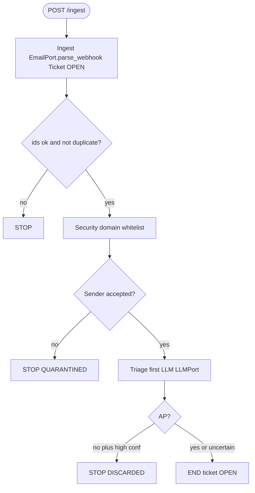
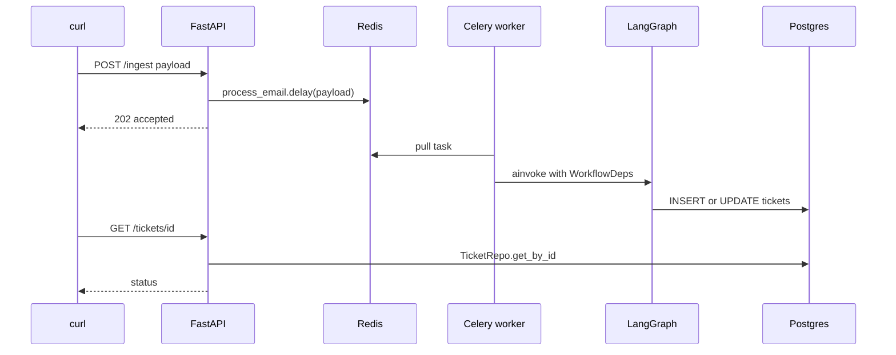
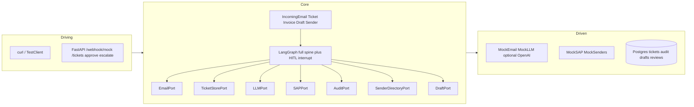
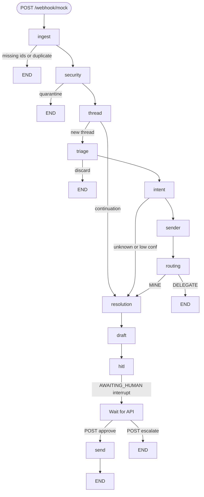
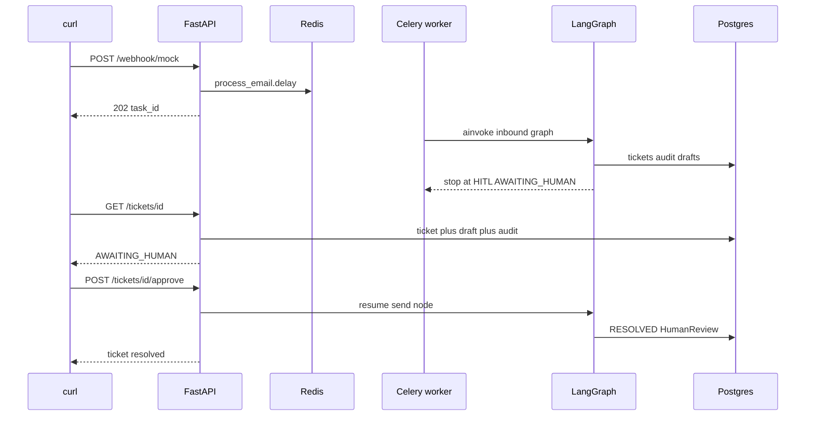

# Call diagrams — mini-lab (Days 0–2) and full spine (Days 3–6)

Mirror of `P2P/diagrams/P2P_AI_CALL_DIAGRAMS.md`. **No Streamlit.**

Paste each Mermaid block into [mermaid.live](https://mermaid.live), Notion, or diagrams.net → *Arrange → Insert → Advanced → Mermaid*.

`LAB_CALL_DIAGRAMS.drawio` has the same views (pages 1–3 = mini-lab; pages 4–6 = full spec).

---

## Days 0–2 — three ports, three nodes

### 1. Hexagonal architecture (mini-lab)

**Pitch:** the graph and domain do not import Postgres, Redis, or the LLM client. Traffic goes through **ports**; **adapters** swap (memory in tests, Postgres in the worker) without rewriting nodes.

FastAPI never talks to the LLM. Triage never imports `openai`. Ingest never imports SQLModel — only `TicketStorePort.save_ticket`.

### 2. LangGraph (3 nodes)

**Pitch:** a payload visits at most **three** nodes. Early exits: reject ingest, quarantine, discard. **No** Thread, Intent, HITL, or Send.

Ingest and security are deterministic. Thread (assistant 1.5) **does not exist** until Day 4.

### 3. Runtime — request → queue → worker → DB

**Pitch:** LangGraph runs **inside** the worker, not in the FastAPI process (except sync fallback).

If the worker is down: POST may still return 202; GET has no row until ingest runs. If `alembic upgrade` did not run: `save_ticket` fails.

---

## Days 3–6 — seven ports, full workflow, HITL via API

### 4. Hexagon (assistant parity, no Streamlit)

### 5. Full LangGraph spine + HITL

Day 7 retry stays **inside** `resolution` (not extra graph nodes). Default eval has retry off.

### 6. Sequence — webhook through approve

Escalate skips send and writes `ESCALATED`.

---

## Spec → code map

| Step | Assistant | This repo |
|---|---|---|
| Ingest | `IngestionNode` | `app/graph/nodes/ingest.py` |
| Security | `SecurityNode` | `app/graph/nodes/security.py` |
| Thread | `ThreadResolutionNode` | `app/graph/nodes/thread.py` (Day 4) |
| Triage | `TriageNode` | `app/graph/nodes/triage.py` |
| Intent | `IntentNode` | `app/graph/nodes/intent.py` (Day 4) |
| Sender / Routing | `SenderIdNode` / `RoutingNode` | Day 4 nodes |
| Resolution / Draft / HITL / Send | matching node files | Days 5–7 |
| Graph | `TicketWorkflow` | `StateGraph` in `app/graph/app.py` |
| Queue | `process_email.delay` | `app/worker/tasks.py` |
| HITL HTTP | `app/api/hitl.py` + tickets | Day 5 — **no Streamlit** |
| Ports | 7 | 3 until Day 3; then 7 |

---

## What diagrams still omit

Streamlit, OCR, live Nylas/SAP, auto-send. Day 7 retry is an internal loop in Resolution, not a separate box unless you expand the resolution node in a talk.
