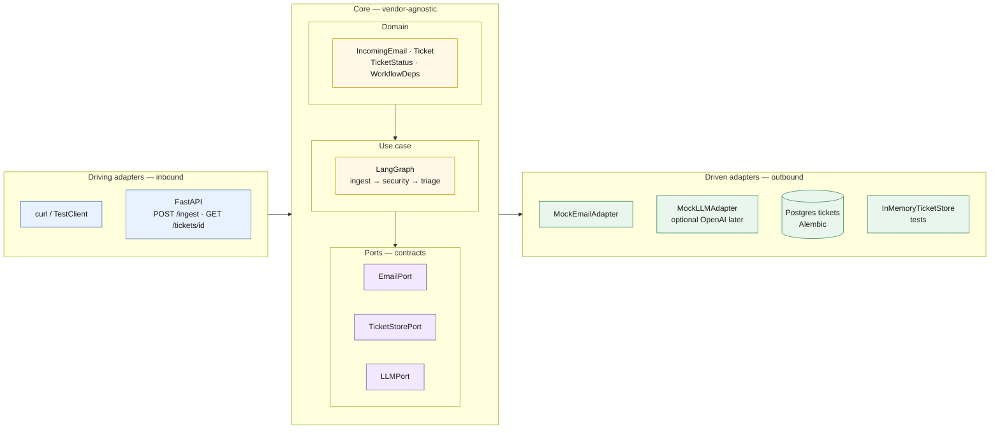
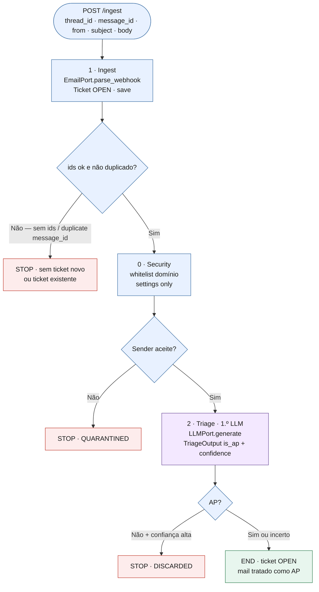
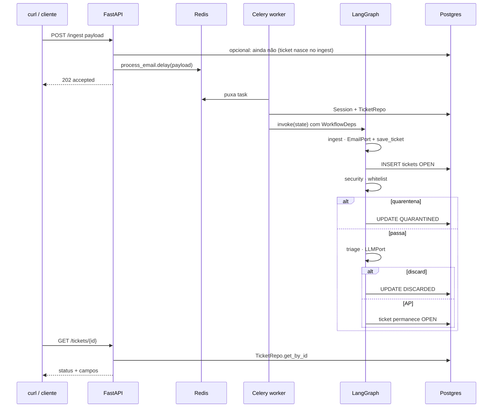

# Mini-lab — diagramas

Espelho de `P2P/diagrams/P2P_AI_CALL_DIAGRAMS.md`, **só** o âmbito do lab (Ingestão → Segurança → Triagem + API/Celery/Postgres).

Cola cada bloco Mermaid em [mermaid.live](https://mermaid.live), Notion, ou diagrams.net → *Arrange → Insert → Advanced → Mermaid*.

`LAB_CALL_DIAGRAMS.drawio` tem as mesmas três vistas, editável no draw.io.

---

## 1. Arquitectura hexagonal

**Pitch:** o grafo e o domínio não importam Postgres, Redis nem o cliente LLM. Entram e saem por **ports**; os **adapters** mudam (memória nos testes, Postgres no worker) sem reescrever os nós.

**O que nunca atravessa o hexágono:** o endpoint FastAPI não fala com o LLM; o nó de triagem não importa `openai`; o nó de ingestão não importa SQLModel — só `TicketStorePort.save_ticket`.

---

## 2. Grafo LangGraph (3 nós)

**Pitch:** um payload percorre no máximo **três** nós. Há três saídas cedo (rejeitar ingest, quarentena, discard). **Não** há Thread, Intent, HITL nem Send.

Numeração = P2P. Ordem de execução = ingestão **antes** de segurança (para poder gravar `QUARANTINED` no ticket).

**LLM só no nó 2.** Ingestão e segurança são 100% determinísticos. Thread (1.5 no P2P) **não existe** neste lab.

---

## 3. Runtime — request → fila → worker → BD

**Pitch:** isto é o que o lab existe para sentires. O LangGraph corre **dentro** do worker, não no processo do FastAPI (salvo fallback).

**Se o worker estiver parado:** o POST devolve 202, o GET fica `queued` / ticket ainda não existe até o ingest correr — documenta o que a tua implementação faz (criar ticket só no grafo vs criar `queued` na API).

**Se `alembic upgrade` não correu:** o worker falha ao `save_ticket` (tabela `tickets` inexistente).

---

## Mapa spec → código (lab)

| Passo | P2P | Lab |
|---|---|---|
| 1 Ingestion | `IngestionNode` | `app/graph/nodes/ingest.py` |
| 0 Security | `SecurityNode` | `app/graph/nodes/security.py` |
| 2 Triage | `TriageNode` | `app/graph/nodes/triage.py` |
| Grafo | `TicketWorkflow` | `StateGraph` em `app/graph/app.py` |
| Fila | `process_email.delay` | idem, `app/worker/tasks.py` |
| Ports | 7 | 3: Email, TicketStore, LLM |

---

## O que estes diagramas **não** mostram (de propósito)

HITL, SendNode, SAP, Sender directory, 10 nós, Streamlit. Isso está em `P2P/diagrams/`.
